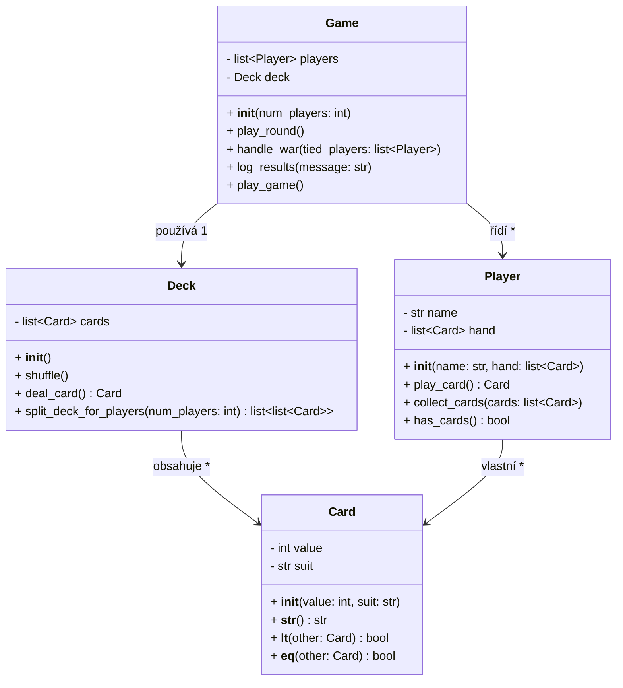

# Cards_war
Simulace karetní hry "Vojna" v Pythonu

## 📌 Cíl úkolu:
Vaším úkolem je naprogramovat simulaci karetní hry Vojna v jazyce Python s využitím objektově orientovaného programování (OOP). Hra bude podporovat 2 až 4 hráče a bude mít přehledné logování do souboru.

Hlavní herní logiku bude řídit soubor **Cards_war.py**, který bude využívat třídy Card, Deck a Player, 
přičemž každá třída bude ve vlastním souboru (modulu).

## 🛠 Požadavky na implementaci
### 1️⃣ Třída Card (card.py)
* ✅ Uchovává hodnotu (2–14, kde 11 = J, 12 = Q, 13 = K, 14 = A) a barvu (♠ ♥ ♦ ♣).
* ✅ Přetížená metoda __str__() umožní čitelný výstup (např. "A♠").
* ✅ Implementace metod __lt__ (<) a __eq__ (==) umožní snadné porovnání karet.

### 2️⃣ Třída Deck (deck.py)
* ✅ Vytváří standardní balíček 52 karet.
* ✅ Metoda shuffle() zamíchá balíček.
* ✅ Metoda deal_card() odebírá vrchní kartu balíčku.
* ✅ Metoda split_deck_for_players(num_players) rozdělí balíček mezi hráče.

### 3️⃣ Třída Player (player.py)
* ✅ Uchovává seznam karet hráče.
* ✅ Metoda play_card() zahraje vrchní kartu z balíčku.
* ✅ Metoda collect_cards(won_cards) přidá vyhrané karty na konec balíčku.
* ✅ Metoda has_cards() kontroluje, zda hráč má ještě karty.

### 4️⃣ Hlavní skript Cards_war.py (herní logika)
* ✅ Podporuje 2 až 4 hráče.
* ✅ Vytváří hráče, rozdělí karty a automaticky řídí hru.
* ✅ Každý hráč zahraje jednu kartu v každém kole.
* ✅ Vítěz kola vezme všechny karty.
* ✅ Při remíze dochází k vojně:
    * Každý hráč položí jednu kartu lícem dolů a jednu lícem nahoru.
    * Hráč s nejvyšší kartou vyhrává všechny karty v sázce.
    * Pokud znovu dojde k remíze, vojna pokračuje.
    * Pokud hráč nemá dost karet na vojnu, prohrává hru.

* ✅ Hra končí, když zůstane jen jeden hráč s kartami.
* ✅ Nastavit konečný počet kol při cyklení - např. 1000.

### 5️⃣ Logování (cards_war.log)
* ✅ Každé kolo je automaticky zaznamenáno do souboru cards_war.log.
* ✅ Zaznamenává se:
    * Zahájení hry a seznam hráčů.
    * Průběh jednotlivých kol (kdo co zahrál a kdo vyhrál).
    * Výskyt vojny a její výsledek.
    * Konec hry a vítěz.
* ✅ Rozšíření: Použití dekorátoru @log_action, který umožňuje automatické logování bez změny původního kódu.

## 📌 Ukázka logu:
    2025-03-11 08:01:09 - Kolo 385: Válek A♥, Hrnčiřík 7♣ → Vítěz: Válek
    2025-03-11 08:01:09 - VOJNA mezi Válek, Hrnčiřík → Vítěz: Válek
    2025-03-11 08:01:09 - Kolo 387: Válek J♠, Hrnčiřík 6♦ → Vítěz: Válek
    2025-03-11 08:01:09 - Kolo 388: Válek J♦, Hrnčiřík 5♠ → Vítěz: Válek
    2025-03-11 08:01:09 - Kolo 389: Válek 10♥, Hrnčiřík 5♣ → Vítěz: Válek
    2025-03-11 08:01:09 - Kolo 390: Válek 2♦, Hrnčiřík 5♦ → Vítěz: Hrnčiřík
    2025-03-11 08:01:09 - Kolo 391: Válek 7♠, Hrnčiřík 6♥ → Vítěz: Válek
    2025-03-11 08:01:09 - Kolo 392: Válek 3♣, Hrnčiřík 2♠ → Vítěz: Válek
    2025-03-11 08:01:09 - Kolo 393: Válek 3♦, Hrnčiřík J♣ → Vítěz: Hrnčiřík
    2025-03-11 08:01:09 - Kolo 394: Válek 3♥, Hrnčiřík 8♥ → Vítěz: Hrnčiřík
    2025-03-11 08:01:09 - Kolo 395: Válek K♣, Hrnčiřík Q♥ → Vítěz: Válek
    2025-03-11 08:01:09 - Kolo 396: Válek 6♣, Hrnčiřík 4♠ → Vítěz: Válek
    2025-03-11 08:01:09 - Kolo 397: Válek 10♦, Hrnčiřík 7♥ → Vítěz: Válek
    2025-03-11 08:01:09 - Kolo 398: Válek 8♦, Hrnčiřík 2♦ → Vítěz: Válek
    2025-03-11 08:01:09 - Kolo 399: Válek K♥, Hrnčiřík 5♦ → Vítěz: Válek
    2025-03-11 08:01:09 - Kolo 400: Válek 9♥, Hrnčiřík 3♦ → Vítěz: Válek
    2025-03-11 08:01:09 - VOJNA mezi Válek, Hrnčiřík → Vítěz: Válek
    2025-03-11 08:01:09 - Hra skončila! Vítěz: Válek

**💡 Možné rozšíření**: Ukládání logu do různých souborů podle data hry.

## 📌 Ukázka výstupu do terminálu:

    === Kolo 400 ===
    Válek zahrál: 9♥
    Hrnčiřík zahrál: 3♦
    Válek vyhrává kolo!
    Válek (karet: 40) | Hrnčiřík (karet: 3)

    === Kolo 401 ===
    Válek zahrál: J♥
    Hrnčiřík zahrál: J♣
    Remíza mezi Válek, Hrnčiřík! VOJNA!
    Každý hráč přidává jednu kartu lícem dolů...
    Každý hráč přidává jednu kartu lícem nahoru...
    Válek zahrál: 10♣
    Hrnčiřík zahrál: 8♥
    Válek vyhrává VOJNU!
    Válek (karet: 43) | Hrnčiřík (karet: 0)

    === Konec hry! Vítěz: Válek ===

## 🎯 Bonusové rozšíření (nepovinné, pro pokročilé)
* 🔹 Automatické ukládání výsledků her a statistiky hráčů.
* 🔹 GUI rozhraní – vizualizace hry pomocí tkinter nebo pygame.

## Základní doporučení
* 🔹 Kód by měl být přehledný, dobře okomentovaný a ideálně splňovat PEP8.
* 🔹 Dodržujte OOP principy a rozdělte odpovědnosti mezi třídy.
* 🔹 Dodržte strukturu repozitáře.
* 🔹 Popřemýšlejte o vhodném založení vlastní knihovny (např. pro logování, verifikace vstupů atd.)

## 📢 Shrnutí:
* ✅ Podpora 2 až 4 hráčů.
* ✅ Automatická hra se správnou logikou vojny.
* ✅ Modulární OOP architektura.

### Mermaid diagramy
Viz https://mermaid.js.org/syntax/classDiagram.html

